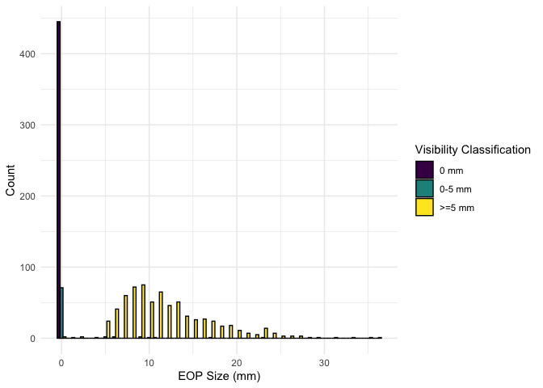
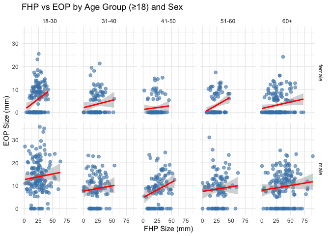

p8105_mtp_cz2955
================
2025-10-21

## Wordcount

``` r
wordcountaddin::word_count("p8105_mtp_cz2955.rmd")
```

    ## For information on available language packages for 'koRpus', run
    ## 
    ##   available.koRpus.lang()
    ## 
    ## and see ?install.koRpus.lang()

    ## 
    ## Attaching package: 'koRpus'

    ## The following object is masked from 'package:wordcountaddin':
    ## 
    ##     readability

    ## [1] 474

## Q1: Data

### (a):

``` r
mid_data<-read_excel("p8105_mtp_data.xlsx")
```

    ## New names:
    ## • `` -> `...2`
    ## • `` -> `...7`
    ## • `` -> `...8`

``` r
colnames(mid_data) <- as.character(mid_data[8, ])
data_clean<- mid_data %>% 
  janitor::clean_names() %>% 
  slice(-(1:8)) %>% 
  mutate(
    sex=factor(sex,
               levels = c("0", "1"),
               labels=c("female", "male")),
    age_group = case_when(
      age_group %in% c("1", "1 = 18-") ~ "18-",
      age_group %in% c("2", "2 = 18-30 age") ~ "18-30",
      age_group %in% c("3", "3 = 31-40") ~ "31-40",
      age_group %in% c("4", "4 = 41-50") ~ "41-50",
      age_group %in% c("5", "5 = 51-60") ~ "51-60",
      age_group %in% c("6", "7", "8", "6, 7, 8 = 60+") ~ "60+",
      TRUE ~ NA_character_
    ) %>% factor(levels = c("18-", "18-30","31-40","41-50","51-60","60+"), ordered = TRUE),
    eop_size_mm = ifelse(is.na(eop_size_mm), 0, eop_size_mm),
    eop_size=factor(eop_size,
                    levels = c("0","1","2","3","4","5"),
                    labels = c("0-5","5-10","10-15","15-20","20-25","25+")
                    ),
    eop_visibility_classification=factor(eop_visibility_classification,
                                         levels = c("0","1","2"),
                                         labels = c("0 mm", "0-5 mm", ">=5 mm"),
                                         ordered = TRUE
                                         ),
    fhp_category=factor(fhp_category,
                        levels=c("0","1","2","3","4","5","6","7"),
                        labels=c("0-10mm","10-20mm","20-30mm","30-40mm","40-50mm","50-60mm","60-70mm","70-80mm")
                        ),
    eop_size_mm = as.numeric(eop_size_mm),
    fhp_size_mm = as.numeric(fhp_size_mm),
    age = as.numeric(age)
    ) %>% 
  filter(age >= 18) %>% 
  filter(age_group != "18-")
```

### (b):

``` r
n_participants <- nrow(data_clean)
n_participants
```

    ## [1] 1219

``` r
age_sex_table <- table(data_clean$age_group, data_clean$sex)
age_sex_table_filtered <- age_sex_table[rownames(age_sex_table) != "18-", ]
age_sex_table_filtered
```

    ##        
    ##         female male
    ##   18-30    151  152
    ##   31-40    102  102
    ##   41-50    106  101
    ##   51-60     99  101
    ##   60+      155  150

Ans: I deleted the first eight rows of the original dataset, replaced
the NA values for “eop_size_mm” with “0”, and then replaced the
categorical variables with feature factors. There are total
1219participants. The age and gender distribution is shown in the table
above.

### (c):

``` r
ggplot(data_clean, aes(x = eop_size_mm, fill = eop_visibility_classification)) +
  geom_histogram(binwidth = 1, position = "dodge", color="black") +
  theme_minimal() +
  labs(x = "EOP Size (mm)", y = "Count", fill = "Visibility Classification")
```

<!-- -->
Ans: (1) As the histogram shown, there are some “\>=5mm” eop_size that
are under 5, which the eop_size and eop_size_mm are not one-by-one
correspondence. (2) The boundary is ambiguous. For instance, within
‘eop_size’, there are boundaries for ‘0-5’ and ‘5-10’, but when
‘eop_size_mm’ equals 5, there is ambiguity regarding its classification.

## Q2: Visualization

### (a):

``` r
data_clean <- data_clean %>%
  mutate(EEOP = ifelse(eop_size_mm > 10, TRUE, FALSE))

p3 <- data_clean %>%
  ggplot(aes(x = age_group, y = fhp_size_mm, fill = sex)) +
  geom_violin(trim = FALSE, alpha = 0.6) +
  geom_boxplot(width = 0.1, outlier.shape = NA, position = position_dodge(0.9)) +
  labs(
    x = "Age Group (years)",
    y = "Forward Head Protraction Size (mm)",
    title = "Distribution of FHP by Age and Sex"
  ) +
  theme_minimal(base_size = 13) +
  theme(legend.position = "top") +
  scale_fill_manual(values = c("black", "white"))


p4_data <- data_clean %>%
  group_by(age_group, sex) %>%
  summarise(rate = mean(EEOP, na.rm = TRUE)) %>%
  ungroup()
```

    ## `summarise()` has grouped output by 'age_group'. You can override using the
    ## `.groups` argument.

``` r
p4 <- p4_data %>%
  ggplot(aes(x = age_group, y = rate, group = sex, shape = sex)) +
  geom_line(aes(linetype = sex)) +
  geom_point(size = 3, fill = "white") +
  scale_y_continuous(labels = scales::percent_format(accuracy = 1)) +
  labs(
    x = "Age Group (years)",
    y = "Rate of Enlarged EOP",
    title = "Proportion of Participants with Enlarged EOP"
  ) +
  theme_minimal(base_size = 13) +
  theme(legend.position = "top")

p3 + p4
```

<!-- -->

### (b):

``` r
data_filtered <- data_clean %>%
  mutate(age_group = droplevels(age_group))

ggplot(data_filtered, aes(x = fhp_size_mm, y = eop_size_mm)) +
  geom_point(alpha = 0.6, size = 2, color = "steelblue") +
  geom_smooth(method = "lm", se = TRUE, color = "red") +
  facet_grid(sex ~ age_group) +  # 现在只会显示 2x5
  labs(
    x = "FHP Size (mm)",
    y = "EOP Size (mm)",
    title = "FHP vs EOP by Age Group (≥18) and Sex"
  ) +
  theme_minimal()
```

    ## `geom_smooth()` using formula = 'y ~ x'

<!-- -->

### (c):

Ans: Based on the scientific question of interest, these figures
illustrate how FHP size, age, and sex are associated with EOP size. (a)
shows that males tend to have larger and more variable FHP sizes than
females. The proportion plot in (a) also indicates that the rate of EOP
enlargement increases with age and is consistently higher among males.
The 2×5 panel figure further demonstrates a positive association between
FHP size and EOP size across most age groups, particularly among males.
Overall, these results support the hypothesis that greater forward head
posture, older age, and male sex are associated with larger EOP size.

## Q3: Reproducing reported results and discussion

### (a):

``` r
n_by_age <- data_clean %>%
  filter(!is.na(age_group)) %>% 
  group_by(age_group) %>%
  summarise(n = n()) %>%
  arrange(age_group)

kable(n_by_age)
```

| age_group |   n |
|:----------|----:|
| 18-30     | 303 |
| 31-40     | 204 |
| 41-50     | 207 |
| 51-60     | 200 |
| 60+       | 305 |

Ans: Thus, the sample composition is approximatly consistent with the
authors’ reported sample, but the specific values are not identical.

### (b):

``` r
fhp_by_sex <- data_clean %>%
  group_by(sex) %>%
  summarise(
    n = n(),
    mean_fhp = mean(fhp_size_mm, na.rm = TRUE),
    sd_fhp = sd(fhp_size_mm, na.rm = TRUE)
  )

fhp_by_sex
```

    ## # A tibble: 2 × 4
    ##   sex        n mean_fhp sd_fhp
    ##   <fct>  <int>    <dbl>  <dbl>
    ## 1 female   613     23.7   10.6
    ## 2 male     606     28.5   14.7

Ans: I found that females have a mean FHP of 23.7 ± 10.6 mm (n = 613),
and males have a mean FHP of 28.5 ± 14.7 mm (n = 606). The trend that
males have larger FHP than females is consistent with the authors’
report, although the exact values may differ slightly due to differences
in sample or measurement.

### (c):

``` r
data_clean <- data_clean %>%
  mutate(EEOP = ifelse(eop_size_mm > 10, TRUE, FALSE))

eeop_overall <- data_clean %>%
  summarise(
    n_total = sum(!is.na(eop_size_mm)),
    n_EEOP = sum(EEOP, na.rm = TRUE),
    prevalence = n_EEOP / n_total
  )

eeop_overall
```

    ## # A tibble: 1 × 3
    ##   n_total n_EEOP prevalence
    ##     <int>  <int>      <dbl>
    ## 1    1219    392      0.322

Ans: Using the EEOP definition (EOP \> 10 mm), the prevalence in our
dataset is 32%. We can use “eop_size_mm” or
“eop_visibility_classification”. This is consistent approximatly with
the authors’ reported 33%.

### (d):

``` r
fhp_over40_60plus <- data_clean %>%
  filter(age_group == "60+") %>%
  summarise(
    n = n(),
    n_fhp_gt40 = sum(fhp_size_mm > 40, na.rm = TRUE),
    proportion = n_fhp_gt40 / n
  )

fhp_over40_60plus
```

    ## # A tibble: 1 × 3
    ##       n n_fhp_gt40 proportion
    ##   <int>      <int>      <dbl>
    ## 1   305         99      0.325

``` r
fhp_by_age <- data_clean %>%
  group_by(age_group) %>%
  summarise(
    mean_fhp = mean(fhp_size_mm, na.rm = TRUE),
    sd_fhp = sd(fhp_size_mm, na.rm = TRUE)
  )

fhp_by_age
```

    ## # A tibble: 5 × 3
    ##   age_group mean_fhp sd_fhp
    ##   <ord>        <dbl>  <dbl>
    ## 1 18-30         24.1   10.3
    ## 2 31-40         22.3   10.7
    ## 3 41-50         24.3   10.6
    ## 4 51-60         25.3   11.5
    ## 5 60+           32.3   16.7

Ans: The proportion of FHP \> 40 mm in the 60+ group is 32%, which is a
little bit different from the reported 34.5%. The mean FHP increases
with age as follows is supported.

### (e):

Ans: Overall, our re-analysis confirms the descriptive findings reported
by the authors: sample sizes, mean FHP values, and EEOP prevalence are
broadly consistent with our dataset. While the data show higher FHP and
EEOP prevalence in older participants and in males, the study design is
cross-sectional, and no measure of cell phone usage or longitudinal
follow-up was provided. Therefore, these data do not provide causal
evidence that cell phone use leads to horn growth. Future research
should include longitudinal measures of device usage, posture, and
FHP/EOP development to test this hypothesis.
